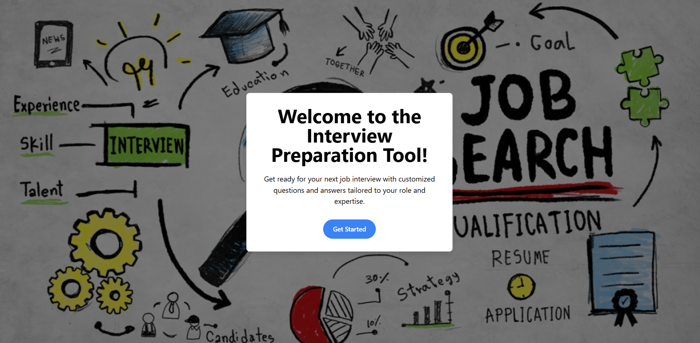
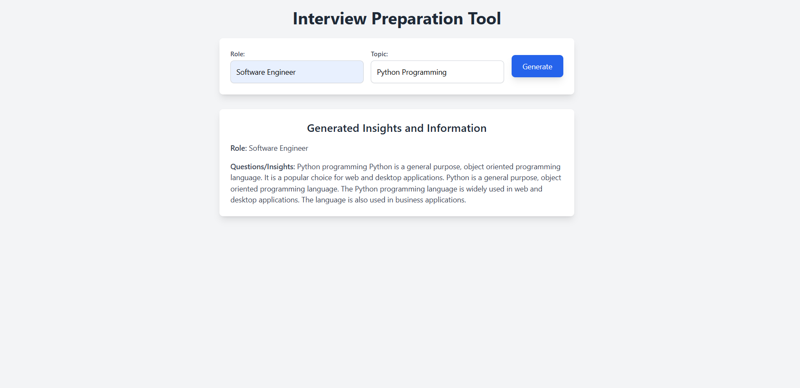
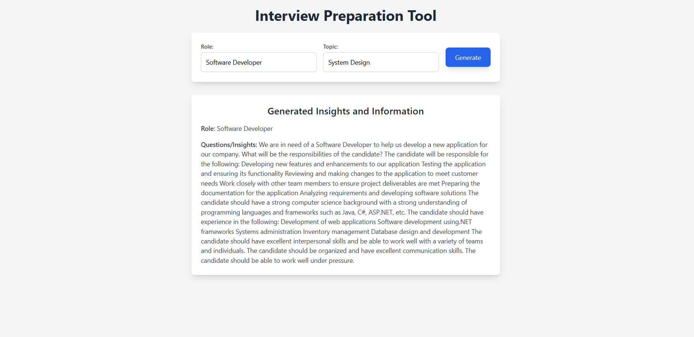

# Angular Frontend - Job Interview Preparation Agent

## 🌐 Landing Page
The landing page provides a simple introduction to the **Job Interview Preparation Agent** and its purpose. It welcomes users to the tool and guides them to start their interview preparation journey.

## 💡 Interview Preparation Page
On the prep page, users can specify their **role** (e.g., software engineer, product manager) and **topic** (e.g., technical questions, soft skills). After clicking the "Generate" button, the app will generate insightful questions and answers related to the specified topic, assisting users in preparing for interviews effectively.

### Example Output:

This page dynamically displays key questions or insights, generated by the backend (via the LLM), tailored to the user's input.

---
Feel free to modify or enhance the UI as needed for a better user experience! 😊
